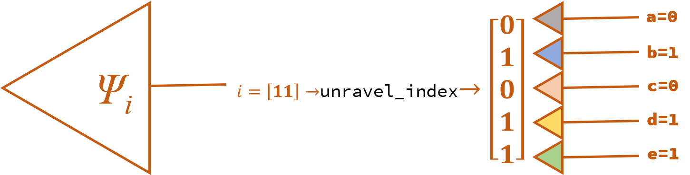

# DMRG_in_quantum_circuit_model  

***DMRG is useful for physical researchers to cross the threshold of quantum computing.***   


## 一：谱分解（spectral decomposition） 
&emsp;&emsp;哈密顿量是Hermitian matrix可以对角化，得到一组**实数**本征能 $\left( E_1 , E_2 , \dots , E_d \right)$ 和对应的一组本征态 $\left( \ket{\hat{e}_1}, \ket{\hat{e}_2}, \dots, \ket{\hat{e}_d}  \right)$ ，哈密顿量就是由本征态密度矩阵线性叠加而来：  

$$\begin{aligned}
\bf{H} &= \it \sum_{i=\rm 1}^{d} E_i\ket{\hat{e}_i}\bra{\hat{e}_i} \\
&=\begin{pmatrix} 
\vert & \vert & \quad & \vert\\ 
\hat{e}_1 & \hat{e}_2 & \cdots & \hat{e}_d\\
\vert & \vert & \quad & \vert\\ 
\end{pmatrix}
\begin{pmatrix} 
E_0 & \quad & \quad & \quad \\ 
\quad & E_1 & \quad & \quad \\
\quad & \quad & \ddots & \quad \\ 
\quad & \quad & \quad & E_d \\ 
\end{pmatrix}
\begin{pmatrix} 
\text{-----} \hspace{-0.2cm} & \hat{e}_1^* & \hspace{-0.2cm} \text{-----}\\
\text{-----} \hspace{-0.2cm} & \hat{e}_2^* & \hspace{-0.2cm} \text{-----} \\
\quad & \vdots & \quad \\ 
\text{-----} \hspace{-0.2cm} & \hat{e}_d^* & \hspace{-0.2cm} \text{-----} \\
\end{pmatrix}
\end{aligned}$$  

也是薛定谔方程的形式：

$$\begin{aligned}
\bf{H} \it \ket{\hat{e}_i} &= E_i \ket{\hat{e}_i} 
\end{aligned}$$

&emsp;&emsp;假设单个粒子有 $d$ 个本征态，那么它张开的希尔伯特空间 $\cal H$ 就有 $d$ 个基矢。以量子计算中常用作量子比特的的电子（electron）和光子（photon）为例，自旋 $\bf{S}$ 在量化轴（quantization axis）确立的参考系下的哈密顿量为：  

$$\begin{aligned}
\bf{H} \it _e &= 
\begin{pmatrix} 
1/2 & 0 \\ 
0 & -1/2 
\end{pmatrix} \\
\bf{H} \it _p &= 
\begin{pmatrix} 
1 & 0 & 0 \\ 
0 & 0 & 0 \\ 
0 & 0 & -1 
\end{pmatrix}
\end{aligned}$$  

对哈密顿量做本征分解，得到单电子希尔伯特空间 $\cal{H}_\rm{1} \in \Bbb{C}^2$ 有两个本征态:  

$$\begin{aligned}
\ket{s_z=\frac{1}{2}}=\ket{&#8593;}=
\begin{pmatrix} 
1 \\ 
0 
\end{pmatrix}  \\
\ket{s_z=-\frac{1}{2}}=\ket{&#8595;}=
\begin{pmatrix} 
0 \\ 
1 
\end{pmatrix}
\end{aligned}$$  

得到单光子希尔伯特空间 $\cal H_\rm{1} \in \Bbb{C}^3$ 有三个本征态（left-handedness\anti-clockwise, linear, right-handedness\clockwise）:

$$\begin{aligned}
\ket{s_z=1}=\ket{\circlearrowleft}=
\begin{pmatrix} 
1 \\ 
0 \\ 
0 
\end{pmatrix} \\
\ket{s_z=0}=\ket{\leftrightarrow}=
\begin{pmatrix}  
0 \\ 
1 \\ 
0 
\end{pmatrix} \\
\ket{s_z=-1}=\ket{\circlearrowright}=
\begin{pmatrix} 
0 \\ 
0 \\ 
1 
\end{pmatrix}
\end{aligned}$$  


## 二：量子多体格点模型与量子线路模型  

&emsp;&emsp;量子线路模型是用多个量子比特张开希尔伯特空间，并施加量子逻辑门对量子态进行酉变换的操作，量子信息存在波函数中，即complex Hilbert space中的向量 $\vec{\psi}$ 。因此，量子线路模型就是一种量子多体问题。   

&emsp;&emsp;根据量子力学[四大公理](https://journals.aps.org/prl/abstract/10.1103/PhysRevLett.126.110402)，复合系统希尔伯特空间 $\cal H_\rm{1,2,\dots,\it N} \in \Bbb{C}^{\overbrace{\it d\times d\times \dots \times d}^{\it{N}}}$ 是子系统希尔伯特空间的张量积 $\cal H_\rm{1} \otimes \cal H_\rm{2} \otimes \cdots \otimes \cal H_{\it{N}}$ 。  

&emsp;&emsp;格点模型（lattice sites）先确定单个点粒子自旋 $\hat s_i$ 的基态，通常用费米子（Fermionic）的电子作为 $d=2$ 的qubit； 用玻色子（Bosonic）的光子作为 $d=3$ 的qutrit 。然后由单个格点的本征态，张开全体 $N$ 个格点的希尔伯特空间的基矢，因此希尔伯特空间的维度为 $L=d^N$ ：    

$$
\hat{e}\left( 
\underbrace{\bullet \bullet \bullet \bullet \bullet \bullet \bullet}_{N} 
\right) = 
\bigotimes_{i=1}^{N}\hat{s_i} = \ket{s_1,s_2,\dots,s_N}
$$

##### 1. 量子比特复合系统的索引

&emsp;&emsp;以超导量子比特为例，单比特希尔伯特空间 $\cal H_{\it{q}_\rm{0}}$ 的基矢记作：  

$$\begin{aligned}
\ket{0}=
\begin{pmatrix} 
1 \\ 
0 
\end{pmatrix}  \\
\ket{1}=
\begin{pmatrix} 
0 \\ 
1 
\end{pmatrix}
\end{aligned}$$  

那么3比特系统 $\left( q_0,q_1,q_2 \right)$ 的希尔伯特空间 $\cal H_{q_0,q_1,q_2}$ 的基矢记作如下三种形式，分别为张量指标、独热编码、列表索引：  

$$
\hat{e}_{q_0,q_1,q_2} = 
\begin{cases} 
\ket{0,0,0}=\begin{pmatrix} 1&0&0&0&0&0&0&0 \end{pmatrix}^T=\ket{0} \\ 
\ket{0,0,1}=\begin{pmatrix} 0&1&0&0&0&0&0&0 \end{pmatrix}^T=\ket{1} \\
\ket{0,1,0}=\begin{pmatrix} 0&0&1&0&0&0&0&0 \end{pmatrix}^T=\ket{2} \\
\ket{0,1,1}=\begin{pmatrix} 0&0&0&1&0&0&0&0 \end{pmatrix}^T=\ket{3} \\ 
\ket{1,0,0}=\begin{pmatrix} 0&0&0&0&1&0&0&0 \end{pmatrix}^T=\ket{4} \\ 
\ket{1,0,1}=\begin{pmatrix} 0&0&0&0&0&1&0&0 \end{pmatrix}^T=\ket{5} \\
\ket{1,1,0}=\begin{pmatrix} 0&0&0&0&0&0&1&0 \end{pmatrix}^T=\ket{6} \\
\ket{1,1,1}=\begin{pmatrix} 0&0&0&0&0&0&0&1 \end{pmatrix}^T=\ket{7} \\ 
\end{cases}
$$

##### 2. 张量指标与独热编码  
&emsp;&emsp;各量子比特的基矢做克罗克内积就生成了独热编码，例如：  

$$
\ket{1,0,0}=\begin{pmatrix} 0 \\ 1 \end{pmatrix} \otimes \begin{pmatrix} 1 \\ 0 \end{pmatrix} \otimes \begin{pmatrix} 1 \\ 0 \end{pmatrix}=\begin{pmatrix} 0\\0\\0\\0\\1\\0\\0\\0 \end{pmatrix}
$$

##### 3. 张量指标与列表索引  
&emsp;&emsp;根据张量指标生成列表索引可以用张量图表示：  

  
代码示例：   
```python
indices_col = np.array([
    [0, 1, 0, 1, 1],
    [1, 1, 0, 1, 0],
    [1, 1, 1, 1, 1]
]).T
N = indices_col.shape[0]
index_row = np.ravel_multi_index(indices_col, dims=(2,)*N)

print(index_row)
>> [11, 26, 31]
```
&emsp;&emsp;根据列表索引找到张量指标可以用张量图表示：  

  
代码示例： 
```python
N = 5
index_row = np.array([11, 26, 31])
indices_col = np.unravel_index(index_row, shape=(2,)*N)
indices_col = np.array(indices_col)

print(indices_col)
>> array([[0, 1, 1],
>>        [1, 1, 1],
>>        [0, 0, 1],
>>        [1, 1, 1],
>>        [1, 0, 1]], dtype=int64)
```

##### 4. 复合系统的量子态   

&emsp;&emsp;$N$ 个量子比特的复合系统 $\left\{ q_0,q_1,\dots,q_{N-1} \right\}$ ，张开的希尔伯特空间是 $L=2^N$ 维，态矢量 $\hat{\psi}$ 是这 $L$ 个正交基的系数。  

$$\begin{aligned}
\hat{\psi} &= \begin{pmatrix} \vert \\ \psi_i \\ \vert \\ \end{pmatrix} \in \Bbb{C}^{L \times 1} \\ 
\hat{\psi}^\dagger &= \begin{pmatrix} \text{---} \hspace{-0.2cm} & \psi_i^* & \hspace{-0.2cm} \text{---} \end{pmatrix} \in \Bbb{C}^{1 \times L} 
\end{aligned}$$   

实际上量子态也是一个 $N$ 阶张量 $\Psi_{q_0,q_1,\dots,q_{N-1}} \in \Bbb{C}^{\overbrace{2\times 2\times \dots \times 2}^{\it{N}}}$


## 三：施密特分解（Schmidt decomposition） 

$[\textcolor{red}{●●}][●●●]$  
